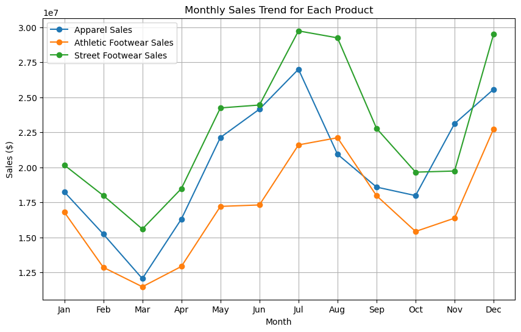
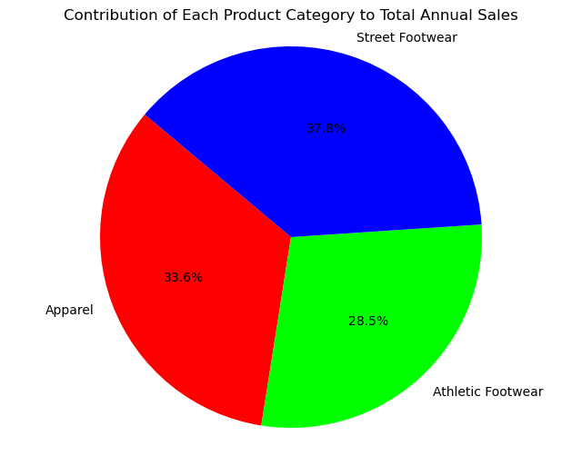

- ### Student: Soltan Soltanli
- ### Assignment: Exploratory sales data analysis
<hr>

##### As you can see our data is like below:


```python
# Student: Soltanli Soltan

# The list of monthly sales figures for Apparel sales
apparel_sales = [
    18251671.00, 15242711.00, 12064875.00, 16314776.00,
    22132203.00, 24151099.00, 26998459.00, 20936713.00,
    18593788.00, 17987538.00, 23116929.00, 25569434.00
]

# The list of monthly sales figures for Athletic Footwear sales
athletic_footwear_sales = [
    16808834.00, 12868874.00, 11485171.00, 12933552.00,
    17217329.00, 17319448.00, 21602572.00, 22113868.00,
    17980891.00, 15428053.00, 16377630.00, 22745000.00
]

# The list of monthly sales figures for Street Footwear sales
street_footwear_sales = [
    20164891.00, 17990580.00, 15598486.00, 18484636.00,
    24240149.00, 24447006.00, 29733650.00, 29237640.00,
    22782344.00, 19659173.00, 19740481.00, 29500996.00
]
```

- ### There is the list of 3 different product categories' sales numbers
<hr>

- ### Next section contains the solutions of these tasks:
        - 1. Data Preparation
        - 2. Basic Sales Analysis in Python
        - 3. Basic Sales Analysis in Python
        - 4. Advanced Analysis
<hr>

#### Each operation explained with the help of comments (Sentences start with ```#```)


```python
# The function that finds total annual sales based on the given list and returns result
def calculate_total_annual_sales(sales_list):
    return sum(sales_list)

print('The total annual sales for:')

total_annual_sales = {}

# The total annual sales for Apparel category.
apparel_total_annual_sales = calculate_total_annual_sales(apparel_sales)
total_annual_sales['Apparel'] = apparel_total_annual_sales
print('- Apparel category: $', apparel_total_annual_sales)

# The total annual sales for Athletic Footwear category.
athletic_footwear_total_annual_sales = calculate_total_annual_sales(athletic_footwear_sales)
total_annual_sales['Athletic Footwear'] = athletic_footwear_total_annual_sales
print('- Athletic Footwear category: $', athletic_footwear_total_annual_sales)

# The total annual sales for Street Footwear category.
street_footwear_total_annual_sales = calculate_total_annual_sales(street_footwear_sales)
total_annual_sales['Street Footwear'] = street_footwear_total_annual_sales
print('- Street Footwear category: $', street_footwear_total_annual_sales)

# Category has maximum annual sales
print('- Category with the maximum annual sale: ', max(total_annual_sales, key=total_annual_sales.get))

# The function that finds average monthly sales based on the given list and returns result
def calculate_average_monthly_sales(sales_list):
    total_sales = calculate_total_annual_sales(sales_list)
    average_sales = total_sales / len(sales_list)
    return round(average_sales, 2)

print('\nThe average monthly sales for:')

# The average monthly sales for Apparel category.
print('- Apparel category: $', calculate_average_monthly_sales(apparel_sales))

# The average monthly sales for Athletic Footwear category.
print('- Athletic Footwear category: $', calculate_average_monthly_sales(athletic_footwear_sales))

# The  average monthly for Street Footwear category.
print('- Street Footwear category: $', calculate_average_monthly_sales(street_footwear_sales))

# The function that finds the Variance value based on the given list and returns result
def calculate_variance(sales_list):
    # Mean
    mean = calculate_average_monthly_sales(sales_list)
    
    # Variance
    squared_diff = [(x - mean) ** 2 for x in sales_list]
    variance = sum(squared_diff) / len(sales_list)
    
    return round(variance, 2)

print('\nThe variance values for:')

# The variance for Apparel category.
print('- Apparel category: $', calculate_variance(apparel_sales))

# The variance for Athletic Footwear category.
print('- Athletic Footwear category: $', calculate_variance(athletic_footwear_sales))

# The variance for Street Footwear category.
print('- Street Footwear category: $', calculate_variance(street_footwear_sales))

# The function that finds the Standart Deviation value based on the given list and returns result
def calculate_standart_deviation(sales_list):
    variance = calculate_variance(sales_list)
    standart_deviation = variance ** 0.5
    return round(standart_deviation, 2)

print('\nThe standart deviation values for:')

# The standart deviation value for Apparel category.
print('- Apparel category: $', calculate_standart_deviation(apparel_sales))

# The standart deviation value for Athletic Footwear category.
print('- Athletic Footwear category: $', calculate_standart_deviation(athletic_footwear_sales))

# The standart deviation value for Street Footwear category.
print('- Street Footwear category: $', calculate_standart_deviation(street_footwear_sales))

print('\nThe total sales by each month and grand total:')

# The function that finds the monthly sales and grand total number based on the given list (or lists) and returns result
def calculate_monthly_sales(*args):
    result = {}
    grand_total = 0
    
    # Looping in list (or lists)
    for sale_list in args:
        # Inside of list
        for index in range(len(sale_list)):
            # If value exists in my dictionary, I just add
            if index in result:
                result[index] += sale_list[index]
            # Else I assigne this value itself as initial
            else:
                result[index] = sale_list[index]
                
            # Anyway I add to grand total
            grand_total += sale_list[index]
                
    return result, grand_total

total_monthly_sales, grand_total = calculate_monthly_sales(apparel_sales, athletic_footwear_sales, street_footwear_sales)

# The function that classify the numbers with month names based on the given dictionary and returns result
def classify_numbers_with_month_names(dictionary):
    classification_data = {
        0: "January",
        1: "February",
        2: "March",
        3: "April",
        4: "May",
        5: "June",
        6: "July",
        7: "August",
        8: "September",
        9: "October",
        10: "November",
        11: "December"
    }

    # Replacing numbers with month names
    for key in classification_data:
        if key in dictionary:
            dictionary[classification_data[key]] = dictionary[key]
            del dictionary[key]
            
    return dictionary

classified_total_monthly_sales = classify_numbers_with_month_names(total_monthly_sales)

# After classifying based on months, printing
for key in classified_total_monthly_sales:
    print('- ', key, ': $', classified_total_monthly_sales[key])
    
print('\n- Grand Total: $', grand_total)
print('- The month with highest overall sales: ', max(classified_total_monthly_sales, key=classified_total_monthly_sales.get))

# Combining 3 lists to 1 list (I mean summing them and merging in a single array)
combined_sales = [sum(x) for x in zip(apparel_sales, athletic_footwear_sales, street_footwear_sales)]

# Calculating total...
print('\nTotal: ')

# Mean
total_mean = calculate_average_monthly_sales(combined_sales)
print('- Mean: $', total_mean)

# Variance
total_variance = calculate_variance(combined_sales)
print('- Variance: $', total_variance)

# Standart Deviation
total_standart_deviation = calculate_standart_deviation(combined_sales)
print('- Standart Deviation: $', total_standart_deviation)

# The function that calculates the monthly growth based on the given sales and returns result
def calculate_monthly_growth(sales):
    growth = []
    for i in range(1, len(sales)):
        monthly_growth = ((sales[i] - sales[i-1]) / sales[i-1]) * 100
        growth.append(round(monthly_growth, 2))
    return growth

# The monthly growth for each product categories
apparel_growth = calculate_monthly_growth(apparel_sales)
athletic_footwear_growth = calculate_monthly_growth(athletic_footwear_sales)
street_footwear_growth = calculate_monthly_growth(street_footwear_sales)

# Printing them...
print('\nApparel Sales Month-on-Month Growth (We skip first month):')
for i, growth in enumerate(apparel_growth):
    print('- Month ', i + 2, ': ', growth)
    
print('\nAthletic Footwear Sales Month-on-Month Growth (We skip first month):')
for i, growth in enumerate(athletic_footwear_growth):
    print('- Month ', i + 2, ': ', growth)
    
print('\nStreet Footwear Sales Month-on-Month Growth (We skip first month):')
for i, growth in enumerate(street_footwear_growth):
    print('- Month ', i + 2, ': ', growth)
    
# The function that calculates the average growth based on the given growth indicators and returns result
def calculate_average_growth(growth):
    return sum(growth) / len(growth)

# The average growth for each product categories
apparel_avg_growth = calculate_average_growth(apparel_growth)
athletic_footwear_avg_growth = calculate_average_growth(athletic_footwear_growth)
street_footwear_avg_growth = calculate_average_growth(street_footwear_growth)

# The dictionary that keeps average growth numbers by the categories (We groups categories by their average growth)
avg_growth_rates = {
    "Apparel": apparel_avg_growth,
    "Athletic Footwear": athletic_footwear_avg_growth,
    "Street Footwear": street_footwear_avg_growth
}

# The maximum average growth category
highest_avg_growth_product = max(avg_growth_rates, key=avg_growth_rates.get)

# Printing...
print('\nThe product with the highest average monthly growth rate is ', highest_avg_growth_product, ' with an average growth rate of ', round(avg_growth_rates[highest_avg_growth_product], 2))
```

    The total annual sales for:
    - Apparel category: $ 241360196.0
    - Athletic Footwear category: $ 204881222.0
    - Street Footwear category: $ 271580032.0
    - Category with the maximum annual sale:  Street Footwear
    
    The average monthly sales for:
    - Apparel category: $ 20113349.67
    - Athletic Footwear category: $ 17073435.17
    - Street Footwear category: $ 22631669.33
    
    The variance values for:
    - Apparel category: $ 18373034081350.55
    - Athletic Footwear category: $ 12358124984673.31
    - Street Footwear category: $ 21554412236905.56
    
    The standart deviation values for:
    - Apparel category: $ 4286377.73
    - Athletic Footwear category: $ 3515412.49
    - Street Footwear category: $ 4642672.96
    
    The total sales by each month and grand total:
    -  January : $ 55225396.0
    -  February : $ 46102165.0
    -  March : $ 39148532.0
    -  April : $ 47732964.0
    -  May : $ 63589681.0
    -  June : $ 65917553.0
    -  July : $ 78334681.0
    -  August : $ 72288221.0
    -  September : $ 59357023.0
    -  October : $ 53074764.0
    -  November : $ 59235040.0
    -  December : $ 77815430.0
    
    - Grand Total: $ 717821450.0
    - The month with highest overall sales:  July
    
    Total: 
    - Mean: $ 59818454.17
    - Variance: $ 141852184435004.16
    - Standart Deviation: $ 11910171.47
    
    Apparel Sales Month-on-Month Growth (We skip first month):
    - Month  2 :  -16.49
    - Month  3 :  -20.85
    - Month  4 :  35.23
    - Month  5 :  35.66
    - Month  6 :  9.12
    - Month  7 :  11.79
    - Month  8 :  -22.45
    - Month  9 :  -11.19
    - Month  10 :  -3.26
    - Month  11 :  28.52
    - Month  12 :  10.61
    
    Athletic Footwear Sales Month-on-Month Growth (We skip first month):
    - Month  2 :  -23.44
    - Month  3 :  -10.75
    - Month  4 :  12.61
    - Month  5 :  33.12
    - Month  6 :  0.59
    - Month  7 :  24.73
    - Month  8 :  2.37
    - Month  9 :  -18.69
    - Month  10 :  -14.2
    - Month  11 :  6.15
    - Month  12 :  38.88
    
    Street Footwear Sales Month-on-Month Growth (We skip first month):
    - Month  2 :  -10.78
    - Month  3 :  -13.3
    - Month  4 :  18.5
    - Month  5 :  31.14
    - Month  6 :  0.85
    - Month  7 :  21.62
    - Month  8 :  -1.67
    - Month  9 :  -22.08
    - Month  10 :  -13.71
    - Month  11 :  0.41
    - Month  12 :  49.44
    
    The product with the highest average monthly growth rate is  Street Footwear  with an average growth rate of  5.49
    

### Now it is time to start Visualization Stage!
### Task: Plot a line graph showing the monthly sales trend for each product.
<hr>

#### We will use package named ```matplotlib``` for creating tables & charts.


```python
import matplotlib.pyplot as plt

# Table Months to visualize
table_months = [
    "Jan", "Feb", "Mar", "Apr",
    "May", "Jun", "Jul", "Aug",
    "Sep", "Oct", "Nov", "Dec"
]

# We set the size. The width will be 10 inch while the height will be 6 inch
plt.figure(figsize=(10, 6))

# Adding our product categories with the values of sales
plt.plot(table_months, apparel_sales, label='Apparel Sales', marker='o')
plt.plot(table_months, athletic_footwear_sales, label='Athletic Footwear Sales', marker='o')
plt.plot(table_months, street_footwear_sales, label='Street Footwear Sales', marker='o')

# Setting table title
plt.title('Monthly Sales Trend for Each Product')

# Title for X axis
plt.xlabel('Month')

# Title for Y axis
plt.ylabel('Sales ($)')

# Listing months on the X axis. Also you can pass argument for rotating them (It is optional, I didn't)
plt.xticks(table_months)

# We show which color is which category on the Top Left corner. This command is for this.
plt.legend()
plt.grid(True)

# Visualizing
plt.show()
```


    

    


### Task: Create a pie chart to show the contribution of each product category's annual sales to the total annual sales.


```python
# As you remember we calculated total annual sales for each product category and also grand total.
# Now we won't calculate them again
apparel_contribution = (apparel_total_annual_sales / grand_total) * 100
athletic_footwear_contribution = (athletic_footwear_total_annual_sales / grand_total) * 100
street_footwear_contribution = (street_footwear_total_annual_sales / grand_total) * 100

# Chart Labels
labels = ['Apparel', 'Athletic Footwear', 'Street Footwear']

# Sizes (contributions) for each product category
sizes = [apparel_contribution, athletic_footwear_contribution, street_footwear_contribution]

# Colors for each product category. Let's use RGB :)))
colors = ['#f00', '#0f0', '#00f']

# We set the size. The width will be 8 inch while the height will be 6 inch
plt.figure(figsize=(8, 6))

# Creating Pie Chart, we pass parameters like size, labels, colors, autopct (it is for showing percentages), startangle (it is for rotating circle to choose start point)
plt.pie(sizes, labels=labels, colors=colors, autopct='%1.1f%%', startangle=140)
plt.title('Contribution of Each Product Category to Total Annual Sales')

# Equal aspect ratio ensures that pie is drawn as a circle
plt.axis('equal')  

# Visualizing
plt.show()
```


    

    


### That's it! We are done.
<hr>

### Now I want to share a brief report summarizing my findings and business insights that I derived from this analysis.

First of all, from the <b>technical approach</b>, I learned how to use ```matplotlib``` library, how to create ```table``` and ```chart``` by using this package. Also I improved my Python skills by using ```dictionaries```, ```loops``` and etc. Because of some difficult calculations, I had to research about the mathematical operators. For instance, check ```calculate_variance``` function, there is a line like ```squared_diff = [(x - mean) ** 2 for x in sales_list]```. To be honest, I didn't know about it and learned new. From the <b>business approach</b>, I learned that how can I analyze the sales data in a correct way. The operations including finding <i>mean</i>, <i>variance</i>, <i>standart deviation</i>, <i>growth</i> teached me that how can I calculate some important figures for analysis. It was my brief report about this task assignment. I enjoyed a lot during working on this!
